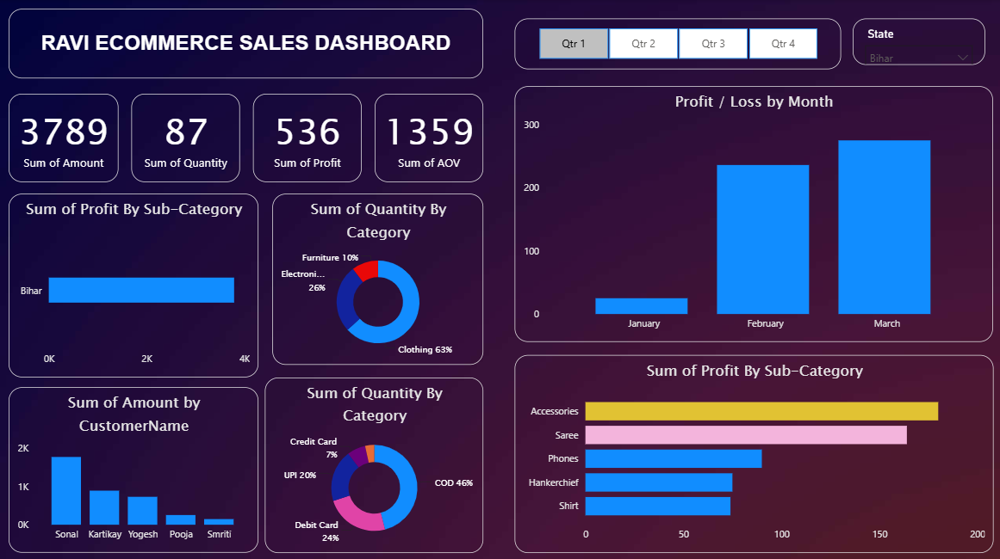
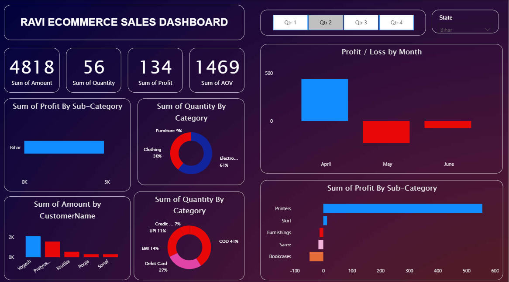
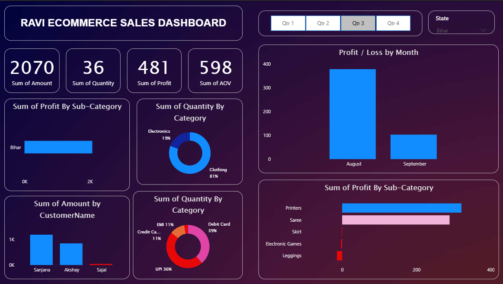
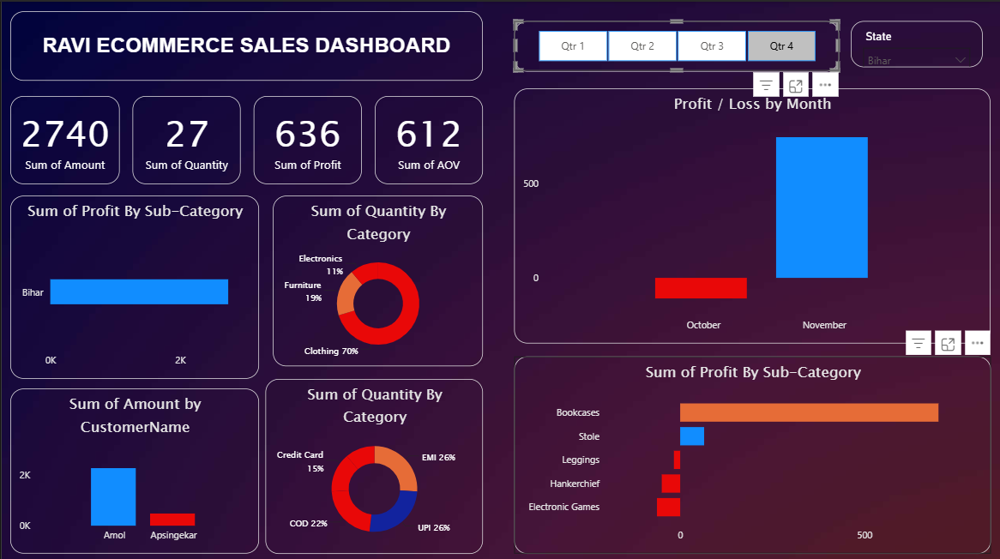

<p align="center">
  
</p>

<h1 align="center">📊 Retail Sales Intelligence Dashboard</h1>

<h3 align="center">
Power BI • Business Intelligence • Data Analytics • Executive Reporting
</h3>

<p align="center">
  
  
  
  
  
</p>

<p align="center">
  
  
  
</p>

---

# 📖 Executive Summary

Retail Sales Intelligence Dashboard is a comprehensive Business Intelligence solution developed in Power BI to monitor sales performance, profitability, customer behavior, category trends, and operational metrics through interactive visual analytics.

The dashboard consolidates multiple business dimensions into a centralized reporting environment, enabling stakeholders to identify opportunities, monitor KPIs, and make informed business decisions using data-driven insights.

---

# 🎯 Business Problem

Retail organizations generate large amounts of transactional data across customers, products, categories, and payment channels.

Without proper analytics, organizations often struggle to:

- Monitor sales performance effectively
- Track profitability trends
- Understand customer purchasing behavior
- Identify high-performing products
- Evaluate category contribution
- Support strategic decision-making

This dashboard addresses these challenges by transforming raw sales data into meaningful business intelligence and executive reporting.

---

# 📊 Key Performance Indicators

The dashboard tracks critical business metrics including:

| KPI | Description |
|------|------------|
| 💰 Total Sales | Overall Revenue Generated |
| 📦 Order Quantity | Total Products Sold |
| 📈 Total Profit | Business Profitability |
| 🛒 Average Order Value | Revenue per Order |
| 👥 Customer Insights | Customer Contribution Analysis |
| 🏷️ Category Analysis | Category-Level Performance |
| 💳 Payment Analytics | Payment Method Distribution |
| 📊 Quarterly Performance | Seasonal Business Analysis |

---

# ✨ Dashboard Features

## 📈 Executive Overview

- Revenue Monitoring
- Profit Tracking
- Order Monitoring
- Average Order Value Analysis

## 🛒 Sales Analytics

- Quarterly Sales Performance
- Monthly Profit Trends
- Revenue Distribution Analysis
- Business Growth Tracking

## 👥 Customer Intelligence

- Customer Contribution Analysis
- Top Customer Identification
- Revenue Contribution Monitoring
- Customer Behavior Insights

## 📦 Product Intelligence

- Product Performance Tracking
- Sub-Category Profit Analysis
- Product Ranking
- Revenue Contribution Analysis

## 🏷️ Category Analytics

- Category Distribution Analysis
- Category Contribution Monitoring
- Comparative Category Performance
- Sales Composition Analysis

## 💳 Financial Analytics

- Payment Method Analysis
- Profitability Monitoring
- Revenue Insights
- Business Performance Evaluation

## 🎛️ Interactive Filtering

- Quarter-Based Filtering
- State-Level Analysis
- Dynamic Dashboard Exploration
- Interactive Business Reporting

---

# 🖼️ Dashboard Preview

## Quarter 1 Performance

<p align="center">
  
</p>

---

## Quarter 2 Performance

<p align="center">
  
</p>

---

## Quarter 3 Performance

<p align="center">
  
</p>

---

## Quarter 4 Performance

<p align="center">
  
</p>

---

# 📈 Business Insights Generated

The dashboard enables organizations to answer critical business questions such as:

- Which quarter generated the highest revenue?
- Which products contribute the most profit?
- Which customers generate maximum business value?
- Which categories drive overall performance?
- What payment methods are most frequently used?
- How does profitability change across different periods?
- What trends influence business growth?

---

# 🏗️ Data Analytics Workflow

```text
Raw Sales Dataset
        │
        ▼
Data Cleaning
        │
        ▼
Power Query Transformation
        │
        ▼
Data Modeling
        │
        ▼
DAX Measures & KPIs
        │
        ▼
Visual Analytics
        │
        ▼
Executive Dashboard
        │
        ▼
Business Insights
```

# 🛠️ Technology Stack

| Category | Technologies |
|-----------|-------------|
| Business Intelligence | Power BI |
| Data Transformation | Power Query |
| Data Modeling | Power BI Data Model |
| Analytics | DAX |
| Visualization | Power BI Visuals |
| Reporting | Interactive Dashboards |

---

# 🚀 Skills Demonstrated

### Business Intelligence

- Dashboard Development
- KPI Design
- Executive Reporting
- Data Storytelling

### Analytics

- Sales Analytics
- Profitability Analysis
- Customer Analytics
- Category Performance Analysis

### Power BI

- DAX Measures
- Power Query
- Data Modeling
- Interactive Visualizations

### Data Analysis

- Trend Analysis
- Performance Monitoring
- Business Reporting
- Decision Support Systems

---

# 💼 Resume Project Description

```text
Developed an interactive Retail Sales Intelligence Dashboard using Power BI to analyze revenue, profitability, customer behavior, product performance, and category trends through KPI-driven visualizations, DAX measures, and business intelligence reporting.
```

---

# 📂 Project Structure

```text
Retail-Sales-Intelligence-Dashboard
│
├── dashboard-q1.png
├── dashboard-q2.png
├── dashboard-q3.png
├── dashboard-q4.png
├── Retail_Sales_Dashboard.pbix
└── README.md
```

---

# 📸 Screenshot Naming Convention

Rename your screenshots exactly as:

```text
dashboard-q1.png
dashboard-q2.png
dashboard-q3.png
dashboard-q4.png
```

Current Mapping:

```text
Screenshot 2026-06-18 094248.png → dashboard-q1.png

Screenshot 2026-06-18 094232.png → dashboard-q2.png

Screenshot 2026-06-18 094212.png → dashboard-q3.png

Screenshot 2026-06-18 094154.png → dashboard-q4.png
```

---

# 👨‍💻 Author

## Ravi Kumar Singh

**Data Engineer | AI Engineer**

💼 LinkedIn  
https://www.linkedin.com/in/ravi-kumar-singh-99777a2a6

💻 GitHub  
https://github.com/mrravi07

🌐 Portfolio  
https://mrravi07.vercel.app

---

<p align="center">
  <b>Transforming Business Data into Actionable Insights</b>
</p>

<p align="center">
  
</p>
